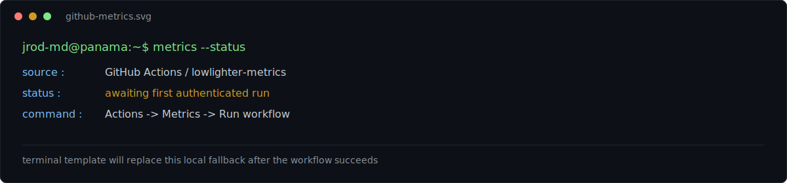

# Hey, I'm José 👋

**Software Development student (UTP, Panama) — Python · Data · ML · Cloud-curious**

---

### About

I'm a Software Development & Management student at Universidad Tecnológica de Panamá (grad. 2027), building things at the intersection of **data, satellite imagery, and computer vision**. Freelance web development through my studio **Ágora**, focused on small Panamanian businesses. Currently exploring Blue Team / OSINT and cloud security on the side.

- 🔭 Currently building: mobile app for used-car scam verification (DS6 semester project)
- 🛰️ Interested in: geospatial data, satellite monitoring pipelines, drones/IoT
- 🌱 Learning: Mandarin (HSK1), cloud security fundamentals
- ⚡ Fun fact: also into chess, sneakers, and building PCs

---

### Tech Stack

---

### Featured Projects

<table>
<tr>
<td width="50%">

**[Azuero Kairós](https://github.com/jrod-md/AzueroKairos)**
Satellite evidence-monitoring pipeline. Integrates the Copernicus Data Space Ecosystem API to process Sentinel-2 bands, calculate MNDWI/NDTI, and apply confidence rules with Sentinel-1 SAR context.
`Python` `Streamlit` `React`

</td>
<td width="50%">

**[SIC-QualityVision](https://github.com/jrod-md/SIC-QualityVision)**
Computer vision system for industrial defect detection using MobileNetV2, with Grad-CAM visualizations for model interpretability.
`Python` `TensorFlow` `CV`

</td>
</tr>
<tr>
<td width="50%">

**[ArmaPortafolio](https://github.com/jrod-md/ArmaPortafolio)**
Web app that organizes academic evidence and auto-generates structured, downloadable digital portfolios.
`JavaScript` `HTML/CSS`

</td>
<td width="50%">

**[Kaisen_DS6](https://github.com/jrod-md/Kaisen_DS6)**
Mobile app project — scam verification tool for Panama's used-car marketplace, with full CRUD backend and an AI-assisted logbook.
`Dart` `Flutter`

</td>
</tr>
</table>

---

### GitHub Metrics

<!--START_SECTION:metrics-->

  

<!--END_SECTION:metrics-->

---

Building in Panama City 🇵🇦 — always open to freelance/collab conversations

